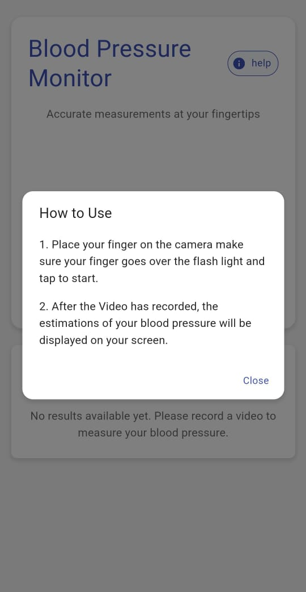

<div align="center">
  <h1>
    
    SmartBP Frontend
    
  </h1>
</div>

<h3 align="center">
  
  Revolutionizing blood pressure measurement through video analysis
  
</h3>

<p align="center">
  
  
  
  
  
</p>

<div align="center">
  
</div>

smartBP-Frontend is a cutting-edge, mobile-friendly web application that leverages the power of video processing and machine learning to measure blood pressure accurately and conveniently.


##  Features

- 📹 **Video Recording**: Capture high-quality video using your device's rear camera
- ⏱️ **Countdown Timer**: Ensure consistent recording duration for accurate results
- 🧠 **AI-Powered Analysis**: Utilize state-of-the-art machine learning models for blood pressure prediction
- 📊 **Instant Results**: View your systolic and diastolic blood pressure values in real-time
- 📱 **Responsive Design**: Optimized for seamless performance across all devices
  
##  Deployment

Explore the live application at our [**deployment link**](https://smart-bp-frontend.vercel.app/)!

## 📸 Screenshots

Take a look at some screenshots from the application:

<div align="center">
  <table>
    <tr>
      <td align="center">
        
        <br/>
        <strong>Home Screen</strong>
      </td>
      <td align="center">
        
        <br/>
        <strong>Help Screen</strong>
      </td>
    </tr>
    <tr>
      <td align="center">
        
        <br/>
        <strong>Recording Screen</strong>
      </td>
      <td align="center">
        
        <br/>
        <strong>Results Screen</strong>
      </td>
    </tr>
  </table>
</div>


##  Technologies

- **[Vite](https://vitejs.dev/)**: Lightning-fast build tool and development server
- **[React](https://reactjs.org/)**: Efficient, declarative UI library for building interactive interfaces
- **[TypeScript](https://www.typescriptlang.org/)**: Strongly-typed programming language for robust application development
- **[Material-UI](https://material-ui.com/)**: Comprehensive library of pre-built, customizable React components
- **[Axios](https://axios-http.com/)**: Promise-based HTTP client for seamless API integration

##  Getting Started

1. **Clone the repository**

   ```bash
   git clone https://github.com/jaideep190/smartBP-Frontend.git
   cd smartBP-Frontend
   ```

2. **Install dependencies**

   ```bash
   npm install
   ```

3. **Start the development server**

   ```bash
   npm run dev
   ```

   Visit `http://localhost:3000` in your browser to see the application in action!

##  Mobile Testing

To test smartBP on your mobile device:

1. Find your computer's local IP address
2. Update `vite.config.ts`:

   ```typescript
   import { defineConfig } from 'vite';
   import react from '@vitejs/plugin-react';

   export default defineConfig({
     plugins: [react()],
     server: {
       host: true,
       port: 3000,
     },
   });
   ```

3. Start the development server
4. Access the app on your mobile device using the provided network URL (e.g., `http://192.168.x.x:3000`)

##  License

This project is licensed under the MIT License - see the [LICENSE](LICENSE) file for details.

##  Acknowledgments

- [Vite](https://vitejs.dev/)
- [React](https://reactjs.org/)
- [TypeScript](https://www.typescriptlang.org/)
- [Material-UI](https://material-ui.com/)
- [Axios](https://axios-http.com/)

<div align="center">
   <em>Thank you for visiting!</em>
</div>

---

<div align="center">
  
</div>